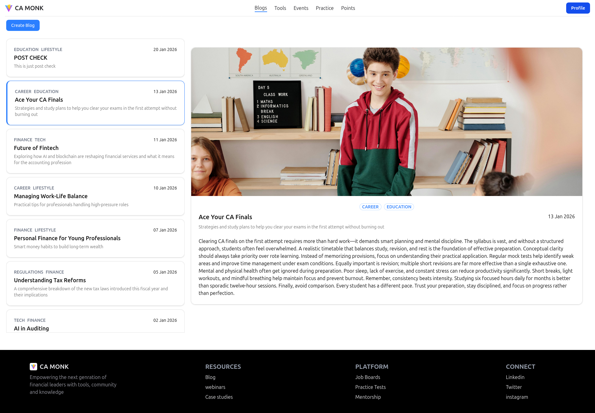
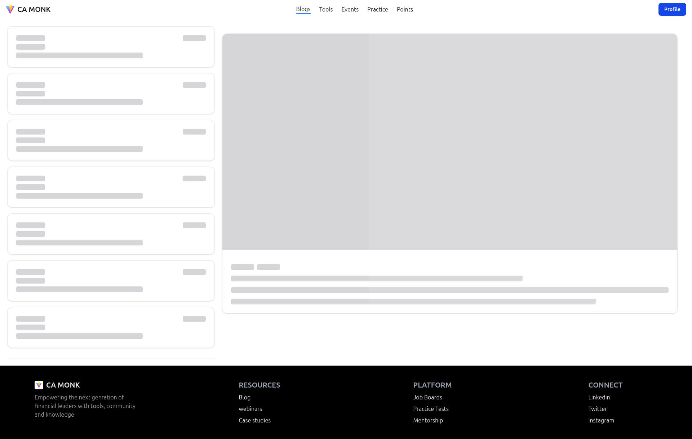

# Blog Management Application

A blog management web application built using React, TypeScript, and TanStack Query.
Users can create blogs, categorize them, select publish dates, and view blogs sorted by latest.

---

## 🚀 Features

- Create blog with title, categories (max 2), description, content, cover image
- Date picker for publish date
- Blogs sorted by latest date
- Blog list + blog detail view
- Loading & error states
- Responsive (mobile & desktop)
- Form validation using Zod + React Hook Form

---

## 🛠 Tech Stack

- React + TypeScript
- Vite
- TanStack Query
- React Hook Form + Zod
- Tailwind CSS
- ShadCN UI
- REST API

---

## 📦 Installation & Setup

```bash
git clone <repo-url>
cd frontend
npm install
```

```bash
Create .env file:
VITE_API=http://localhost:5000
```

```bash
Run the app:
npm run dev
```

---

## 📸 Screenshots

### Blog Page


### Blog Form Page


### Loader View


### Mobile View


---

## 👤 Author

Name: Meet Parmar

Github: https://github.com/MEETparmar230

Portfolio: https://my-portfolio-site-theta-five.vercel.app/